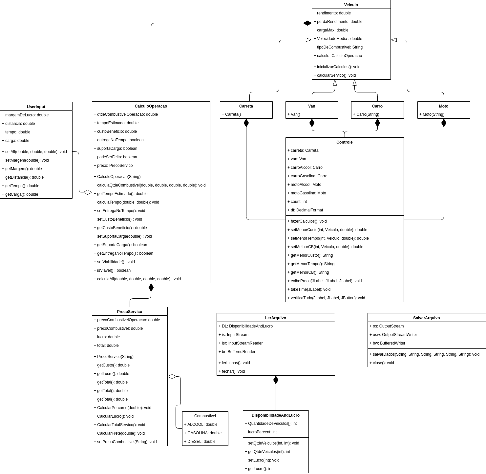

# EP2 - OO 2019.1 (UnB - Gama)

Nome: Wagner Martins da Cunha

## Compilação e Execução

-O projeto foi feito na IDE ApacheNetbeans. Os arquivos que a IDE reconhece como projeto estão todos no repositório.

### Para compilar o arquivo pela IDE

Abra o projeto, clique com o botão direito do mouse no arquivo TransporteIncGUI no caminho 
```
 /src/GUI/TransporteIncGUI
```
e selecione a opção 
```
 Run File
```
### Para compilar o arquivo pelo terminal 

Vá até a pasta
```
 /TransporteInc/src
```
e dê o comando:
```
$ javac GUI/TransporteIncGUI.java -d ../build/classes/
```
volte para a pasta raiz e navegue até
```
 /TransporteInc/build/classes/
```
e digite:
```
$ java GUI.TransporteIncGUI
```

obs: Devido a problemas com o local do arquivo que persiste as informações, o arquivo se encontra em duas pastas diferentes, e cada um serve para um método de execução do programa.

## Diagrama de Classes

 


